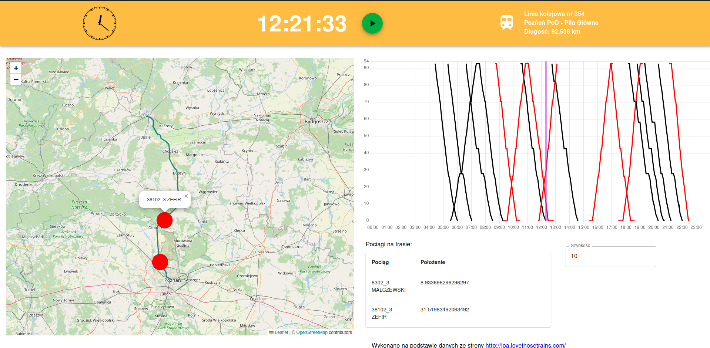

## Smart IPA Analyser

Simple project to visualize railway traffic based on historic data from ipa-archiver.
Currenlty supported only one-day timetable vizusaliztion for 354 railway line (Poznań Gł. POD - .

## Demo

https://smart-ipa-map.netlify.app

## Preview 

